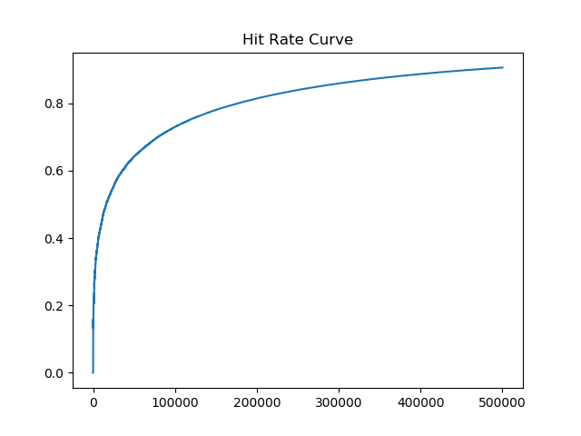
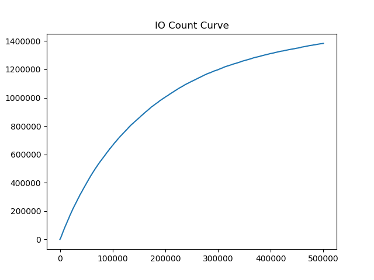

# 高级数据库课程实验 - 实现Storage and Buffer Manager

## 功能需求描述

### 数据管理模块 DataStorageManager
提供记录的增改查操作，作为DBMS的底层模块，为上层缓冲区管理模块提供接口。
- 下层: 调用操作系统提供的文件系统，实现目录式的记录管理
- 上层: 提供读取读取/更新某个页，写入新页等功能
- 外部接口
  - 初始化相关文件信息
  - 读取page
  - 写入新page
  - 更新page
  - 获取页数、IO总数
- 内部接口
  - 打开、关闭文件
  - 读取、更新目录
  - 读取某个目录
- 实现方式优缺点
  - 优点: 扩展性更好，可以存储变长记录
  - 缺点: 读取目录会增加IO次数，实现更复杂
  - 权衡: 重用内存内部的目录，不需要每次从0号目录开始读取

### 缓冲区管理 BufferManager
提供基于LRU的缓存管理功能，提高记录读取/更新的效率。为上层SQL执行模块提供接口，下层调用数据管理模块的接口执行数据更新。
- 上层为记录查询提供增删改查功能
- 下层调用数据管理接口的功能
- 外部接口
  - 读取某个page内容
  - 更新某个page内容
  - 增加一个新page
  - 获取某个frame
  - 获取命中率
  - 获取IO总数
  - 获取LRU头、尾信息
  - 将所有脏页写入磁盘
  - 获取可用frame数目
- 内部接口
  - 根据淘汰算法选择受害者
  - 设置/取消设置一个页为脏页
  - 将所有脏页写入磁盘
  - 打印一个frame的内容
  - 根据LRU算法更新一个缓冲块
  - 根据LRU算法插入一个新的缓冲块

## 数据结构设计

### DataStorageManager
页大小为8KB，使用一页作为目录，存储`N=(8*1024/4)=2*1024`个页地址和下一个目录表的地址。其中页地址与目录表地址为偏移量，使用长整数(4Byte)表示。目录表信息用于重用目录。

- 文件指针: FILE* fp
- 页数: numpages
- 目录表: contents -> int[], **在堆上分配**
- 目录表信息: 目录的偏移量与序号
  - 当前目录在文件中的偏移量: cur_content_offset
  - 当前目录的序号: cur_content_id

### BufferManager
- 缓冲区: buffer[]
- 缓冲区大小: size
- 链表首/尾: head_frame_id, tail_frame_id
- frame->page: frame2page[] 数组
- page->frame: page2frame[] 哈希表
- 缓冲块信息(链表节点): bcb[] -> { frame_id, page_id, dirty, count, prev_frame_id, next_frame_id }
  - 链表结构与哈希表结合使用，使用缓冲块信息保存

## 运行结果

每次执行`fread`或`fwrite`时增加一次IO，总IO数为1383506，IO曲线与命中率曲线如下:

## 问题与解决
- **fread莫名遇到eof，fseek、ftell都没问题**: 打开文件时指定`b`，即以二进制方式打开，如下为`fseek`相关信息  
  > For streams open in binary mode, the new position is defined by adding offset to a reference position specified by origin. For streams open in text mode, offset shall either be zero or a value returned by a previous call to ftell, and origin shall necessarily be SEEK_SET. 

- **目录读取IO过多**: 重用内存中的目录

- **vscode莫名抛出 无法打开....cygwin.s**: 由于栈内数组开的过大，造成了调试器启动失败！！！

- **文件太大，偏移量无法使用int存下**: 并不是文件太大，int作偏移量时文件理论最大值为2GB，所以是因为输入数据中有不正常的数据(50000).另外gcc的 -D_FILE_OFFSET_BITS=64 能够将off_t定义为64位的，因此使用`off_t`作为偏移量的类型之后使用该选项编译运行即可
